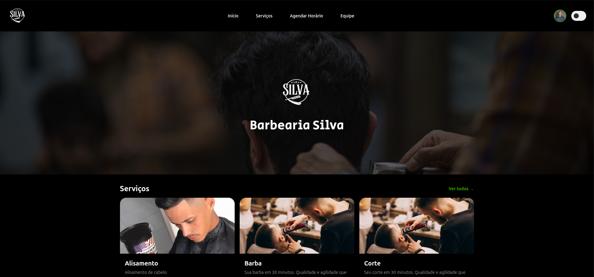
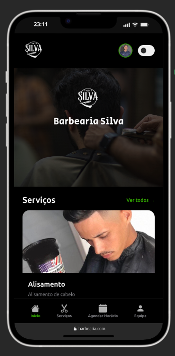

# 💈 Go Next Agendamentos

<div align="center">


**Sistema Web Full-Stack para Gestão e Agendamento de Serviços em barbearias, salões e clínicas**

Sistema profissional de agendamento online com backend em Go, notificações em tempo real e gerenciamento completo

[Sobre](#-sobre) • [Funcionalidades](#-funcionalidades) • [Tecnologias](#-tecnologias) • [Instalação](#-instalação) • [Equipe](#-equipe)

</div>

---

## 📸 Preview do Sistema

<div align="center">

### 💻 Versão Desktop


*Interface moderna e personalizável, sistema completo de comandas/PDV e dashboard administrativo*

### 📱 Versão Mobile


*Layout responsivo com bottom navigation, ícones modernos e experiência otimizada para dispositivos móveis*

</div>

---

## 📋 Sobre

O **Go Next Agendamentos** é uma aplicação web completa desenvolvida para otimizar a gestão de barbearias, oferecendo uma experiência moderna e profissional tanto para clientes quanto para administradores. O sistema combina backend robusto em Go, frontend responsivo e funcionalidades avançadas de notificação.

### 🎯 Objetivo

Criar uma plataforma integrada que simplifique a rotina das barbearias, permitindo:
- Agendamento online de serviços
- Gestão de profissionais e horários
- **Sistema completo de Comandas/PDV** (Novo!)
- **Upload de logos personalizado** (Novo!)
- Autenticação com Firebase (Google Login)
- Interface responsiva e intuitiva
- Experiência otimizada em dispositivos móveis e desktop

---

## ✨ Funcionalidades

### 💰 Sistema de Comandas/PDV (NOVO!)
- **Abertura de comandas** por barbeiro e cliente
- **Adição de serviços e produtos** durante o atendimento
- **Cálculo automático de totais** em tempo real
- **Fechamento com registro de pagamento** (Dinheiro, PIX, Cartão)
- **Relatórios diários** com estatísticas de receita
- **Histórico completo** de todas as comandas
- Interface intuitiva com 3 modais especializados

### 🎨 Sistema de Personalização Completo (NOVO!)
- **Upload de logos personalizado**
  - Logo Dark (tema escuro) e Logo White (tema claro)
  - Favicon customizável
  - Suporte a Base64 e Multipart/Form-Data
- **Personalização de cores**
  - Cores primária, secundária e de destaque
  - Cor do header e textos
  - Aplicação em tempo real via CSS Variables
- **Personalização de banner/hero**
  - Upload de imagem de fundo
  - Textos de título e subtítulo editáveis
  - Controle de altura (pequeno/médio/grande)
- **Personalização de textos**
  - Título do site e meta description (SEO)
  - Texto do botão "Agendar"
  - Slogan e mensagem de rodapé
- **Redes sociais**
  - Links para Instagram, Facebook, TikTok e YouTube
  - Exibição com ícones Font Awesome
  - Opção de ocultar redes sociais
- **Atualização instantânea** em todo o site sem recarregar

### 🔐 Autenticação Avançada
- Login local com email e senha
- **Login com Google via Firebase**
- Logs detalhados para debug em produção
- Proteção de rotas administrativas
- CORS configurado para produção

### 📱 Design Responsivo
- Layout adaptativo para todos os dispositivos
- 7 breakpoints responsivos (380px até 1920px)
- Menu de navegação desktop e mobile
- **Bottom navigation mobile** com ícones modernos
- Otimização para experiência móvel
- **Grid de serviços adaptativo**
  - Home: até 6 serviços em destaque
  - Página de serviços: exibe todos os serviços cadastrados

### 💼 Catálogo de Serviços
- **Corte**: R$ 35,00 (30 minutos)
- **Barba**: R$ 35,00 (30 minutos)
- **Kids**: R$ 35,00 (30 minutos)
- Cards interativos com imagens e descrições
- Layout em grid responsivo

### 🎁 Programa de Fidelidade
- "Complete 10 visitas e ganhe seu próximo corte"
- Banner promocional com call-to-action
- Incentivo ao retorno de clientes

### 👨‍💼 Perfil de Barbeiros
- Destaque para profissionais
- Foto e apresentação do barbeiro (Alison Silva)
- Design elegante e profissional

### 📞 Informações de Contato
- Telefone: 61 00000-0000
- Instagram: @Silva_barbearia
- Endereço: Morro Azul - Quadra 11 Conjunto A
- CNPJ: 00.000.000/0001-00

---

## 🚀 Tecnologias

### Backend
- **Go 1.25.4** - Linguagem de programação de alto desempenho
- **Gin Framework v1.11.0** - Web framework HTTP rápido e minimalista
- **SQLite** - Banco de dados embutido com performance otimizada
- **modernc.org/sqlite** - Driver SQLite puro em Go (CGO-free)
- **bcrypt** - Hash seguro de senhas
- **Clean Architecture** - Separação de camadas (handlers, models, database)
- **Firebase Admin SDK** - Autenticação com Google

### Frontend
- **HTML5** - Estrutura semântica e acessível
- **CSS3** - Estilização moderna com Flexbox e Grid
- **JavaScript (ES6+)** - Interatividade e manipulação do DOM
- **Firebase SDK v9** - Autenticação com Google
- **LocalStorage API** - Persistência de dados client-side
- **Fetch API** - Comunicação com backend REST

### Design
- **Mobile-First** - Prioridade para dispositivos móveis
- **Responsive Design** - Adaptação automática de layout
- **CSS Variables** - Customização de cores e estilos
- **Smooth Transitions** - Animações e transições suaves

---

## 📦 Instalação

### Pré-requisitos
- **Go 1.25.4+** instalado ([Download](https://go.dev/dl/))
- Navegador web moderno (Chrome, Firefox, Safari, Edge)

### Passos

1. **Clone o repositório**
```bash
git clone https://github.com/seu-usuario/Go Next Agendamentos.git
cd Go Next Agendamentos
```

2. **Instale as dependências do backend**
```bash
cd backend
go mod download
```

3. **Inicie o servidor**
```bash
cd cmd/api
go run main.go
```

O servidor iniciará em `http://localhost:8080` e criará automaticamente:
- Banco de dados SQLite em `backend/cmd/api/data/barbearia.db`
- Usuário admin: `admin@barbearia.com` / `admin123`
- Usuário cliente teste: `cliente@teste.com` / `cliente123`
- Barbeiro padrão: Alison Silva
- 4 Serviços: Corte, Barba, Kids, Corte + Barba

4. **Acesse no navegador**
```
http://localhost:8080
```

### 🎯 Rotas Principais
- `/` - Página inicial
- `/login` - Login de usuários
- `/agendar` - Agendamento de horários (requer login)
- `/dashboard` - Painel administrativo (requer login admin)

### 💡 Dica
O sistema funciona em Windows e Linux sem necessidade de compiladores C (CGO-free)!

---

## 📁 Estrutura do Projeto

```
Go Next Agendamentos/
│
├── README.md                          # Documentação unificada do projeto
│
├── backend/                           # Backend em Go
│   ├── cmd/
│   │   └── api/
│   │       ├── main.go               # Entry point da aplicação
│   │       └── data/
│   │           └── barbearia.db      # Banco de dados SQLite
│   ├── internal/
│   │   ├── handlers/                 # Controllers e rotas HTTP
│   │   │   ├── auth.go              # Autenticação
│   │   │   ├── barbeiro.go          # CRUD de barbeiros
│   │   │   ├── horario.go           # Gestão de agendamentos
│   │   │   ├── servico.go           # CRUD de serviços
│   │   │   ├── pages.go             # Renderização de páginas
│   │   │   └── router.go            # Configuração de rotas
│   │   ├── models/                   # Modelos de dados
│   │   │   ├── barbeiro.go          # Model de barbeiro
│   │   │   ├── horario.go           # Model de agendamento
│   │   │   ├── servico.go           # Model de serviço
│   │   │   └── usuario.go           # Model de usuário
│   │   └── database/
│   │       └── sqlite.go             # Configuração e migrações do BD
│   ├── go.mod                        # Dependências Go
│   └── go.sum                        # Lock de dependências
│
├── frontend/                          # Frontend da aplicação
│   │
│   ├── admin/                        # 👨‍💼 ÁREA ADMINISTRATIVA
│   │   ├── dashboard.html           # Dashboard administrativo (renomeado)
│   │   ├── css/
│   │   │   └── dashboard.css        # Estilos do dashboard
│   │   └── js/
│   │       └── dashboard.js         # Lógica do dashboard
│   │
│   ├── client/                       # 👤 ÁREA DO CLIENTE
│   │   ├── home.html                # Página inicial (renomeado)
│   │   ├── servicos.html            # Catálogo de serviços (renomeado)
│   │   ├── barbeiros.html           # Perfil dos barbeiros (renomeado)
│   │   ├── agendar.html             # Página de agendamento (renomeado)
│   │   ├── css/
│   │   │   └── mobile-modern.css    # Estilos responsivos
│   │   └── js/
│   │       ├── auth-client.js       # Autenticação do cliente
│   │       └── home-loader.js       # Carregamento dinâmico da home
│   │
│   ├── auth/                         # 🔐 AUTENTICAÇÃO
│   │   ├── login.html               # Página de login (renomeado)
│   │   └── css/
│   │       └── auth.css             # Estilos de autenticação
│   │
│   └── shared/                       # 🔄 COMPONENTES COMPARTILHADOS
│       ├── js/
│       │   ├── theme-manager.js     # Gerenciador de temas (único)
│       │   └── personalizacao-loader.js  # Carrega personalizações
│       └── config/
│           └── firebase-config.js   # Configuração Firebase
│
├── assets/                            # Assets globais
│   ├── icons/                        # Ícones do sistema
│   └── img/                          # Imagens globais
│       ├── logoDark.jpeg            # Logo escuro
│       ├── logoWhite.jpeg           # Logo claro
│       ├── alissonFt.png            # Foto do barbeiro
│       ├── barba.png                # Serviço de barba
│       ├── kids.jpg                 # Serviço kids
│       └── meta.jpg                 # Serviço de corte
│
└── docs/                              # Documentação e screenshots
    ├── img01.png                     # Preview desktop
    └── img02.png                     # Preview mobile
```

---

## 🎨 Paleta de Cores

```css
--primary-color: #0D7CA4          /* Azul primário (botões/CTAs) */
--background: #F3F4F6             /* Fundo claro */
--bg-card: #FFFFFF                /* Cards brancos */
--text-primary: #1C1C1E           /* Texto principal */
--text-secondary: #6B7280         /* Texto secundário */
--border-color: #E5E7EB           /* Bordas */
--success: #4CAF50                /* Verde (sucesso) */
--warning: #FF9800                /* Laranja (aviso) */
--error: #F44336                  /* Vermelho (erro) */
```

---

## 📱 Breakpoints Responsivos

| Dispositivo | Largura | Características |
|------------|---------|-----------------|
| Desktop XL | 1920px+ | Layout máximo |
| Desktop L  | 1600px  | Containers reduzidos |
| Desktop M  | 1350px  | Navegação ajustada |
| Desktop S  | 1225px  | Cards em 2 colunas |
| Tablet     | 1150px  | Menu mobile ativo |
| Mobile L   | 800px   | Layout vertical |
| Mobile M   | 580px   | Cards reduzidos |
| Mobile S   | 380px   | Telas pequenas |

---

## 🗂️ Componentes

### Header
- Logo da barbearia
- Menu de navegação (Início, Serviços, Agendar, Barbeiros)
- Botão de acesso/login
- Notificações e perfil do usuário

### Main
- **Seção Logo**: Apresentação visual da marca
- **Seção Fidelidade**: Banner promocional com CTA
- **Seção Barbeiro**: Destaque do profissional
- **Seção Catálogo**: Grid de cards com serviços

### Footer
- Logo da barbearia
- Informações de contato
- Redes sociais
- Dados da empresa (CNPJ)

---

## 🔧 Funcionalidades Técnicas

### Sistema de Toasts
```javascript
// Notificações visuais modernas
// 4 tipos: success, error, warning, info
// Auto-fechamento após 5 segundos
// Animações suaves de entrada/saída
```

### Responsividade
- Flexbox para layouts fluidos
- Media queries em cascata
- Mobile-first approach
- Touch-friendly (botões grandes)

### Performance
- CSS modular (5 arquivos separados)
- Imagens otimizadas
- JavaScript minimalista
- Carregamento rápido

---

## 🛣️ Roadmap

### ✅ Fase 1 - Frontend Base (Concluído)
- [x] Design da página inicial
- [x] Layout responsivo completo
- [x] Catálogo de serviços dinâmico
- [x] Seção de barbeiros com múltiplos profissionais
- [x] Sistema de toasts moderno

### ✅ Fase 2 - Backend Completo (Concluído)
- [x] API REST completa para agendamentos
- [x] Banco de dados SQLite funcional
- [x] Sistema de autenticação com bcrypt
- [x] Painel administrativo funcional
- [x] Gerenciamento de horários e disponibilidade
- [x] CRUD de barbeiros e serviços
- [x] Sistema de notificações
- [x] Compatibilidade Windows/Linux (sem CGO)

### ✅ Fase 3 - Agendamento Online (Concluído)
- [x] Sistema de agendamento online completo
- [x] Verificação de disponibilidade em tempo real
- [x] Página de login funcional
- [x] Integração frontend com API
- [x] Carregamento dinâmico de serviços
- [x] Dashboard com métricas

### ✅ Fase 4 - Sistema de Comandas e Upload (Concluído)
- [x] Sistema completo de comandas/PDV
- [x] Abertura e fechamento de comandas
- [x] Adição de serviços e produtos
- [x] Registro de formas de pagamento
- [x] Relatórios diários de receita
- [x] Upload de logos personalizado
- [x] Logs detalhados de autenticação Firebase
- [x] CORS configurado para produção

### 📋 Fase 5 - Melhorias Futuras (Planejado)
- [ ] Notificações por email/SMS
- [ ] PWA (Progressive Web App)
- [ ] Pagamentos online integrados
- [ ] Sistema de avaliações de clientes
- [ ] Analytics e relatórios avançados
- [ ] Chatbot de atendimento
- [ ] Impressão térmica de comandas
- [ ] Migração para PostgreSQL
- [ ] Sistema White Label (multi-tenancy)

---

## 👥 Equipe

<div align="center">

### Desenvolvedores

<table>
  <tr>
    <td align="center">
      <a href="https://github.com/EoDaniel777">
        <br>
        
      </a><br>
      <sub><strong>Daniel Alisom</strong></sub><br>
      <p>🔧 Backend em Go<br>🗄️ Arquitetura de Banco<br>🔐 APIs & Autenticação</p>
    </td>
    <td align="center">
      <a href="https://github.com/B-Evil">
        <br>
        
      </a><br>
      <sub><strong>Bruno Santiago</strong></sub><br>
      <p>🎨 Interfaces Web<br>📱 Responsividade<br>🔌 Integração com APIs</p>
    </td>
    <td align="center">
      <a href="https://github.com/Thaysantzs">
        <br>
        
      </a><br>
      <sub><strong>Thiago Santiago</strong></sub><br>
      <p>🎭 Design UI/UX<br>📲 Otimização Mobile<br>✨ Experiência do Usuário</p>
    </td>
  </tr>
  <tr>
    <td align="center" colspan="3">
      <a href="https://instagram.com/bradock_baber">
        
      </a><br>
      <sub><strong>Alison Silva</strong></sub><br>
      <p>💈 Barbeiro Profissional | 📊 Proprietário da Go Next Agendamentos | 🎯 Visão do Produto</p>
      <sub>📍 Morro Azul - Quadra 11 Conjunto A | 📱 @bradock_baber</sub>
    </td>
  </tr>
</table>

### Tecnologias Utilizadas


</div>

---

## 🔌 APIs Disponíveis

### Autenticação
- **POST** `/api/v1/auth/login` - Login de usuários
- **POST** `/api/v1/auth/register` - Registro de novos clientes
- **GET** `/api/v1/auth/me` - Informações do usuário logado

### Barbeiros
- **GET** `/api/v1/barbeiros` - Listar todos os barbeiros ativos
- **GET** `/api/v1/barbeiros/:id` - Buscar barbeiro por ID
- **POST** `/api/v1/barbeiros` - Criar novo barbeiro (admin)
- **PUT** `/api/v1/barbeiros/:id` - Atualizar barbeiro (admin)
- **DELETE** `/api/v1/barbeiros/:id` - Desativar barbeiro (admin)

### Serviços
- **GET** `/api/v1/servicos` - Listar todos os serviços ativos
- **GET** `/api/v1/servicos/:id` - Buscar serviço por ID
- **POST** `/api/v1/servicos` - Criar novo serviço (admin)
- **PUT** `/api/v1/servicos/:id` - Atualizar serviço (admin)
- **DELETE** `/api/v1/servicos/:id` - Desativar serviço (admin)

### Agendamentos
- **GET** `/api/v1/horarios` - Listar todos os agendamentos
- **GET** `/api/v1/horarios/disponibilidade` - Verificar horários disponíveis
- **POST** `/api/v1/horarios` - Criar novo agendamento
- **PATCH** `/api/v1/horarios/:id/status` - Atualizar status do agendamento
- **DELETE** `/api/v1/horarios/:id` - Cancelar agendamento

### Notificações
- **GET** `/api/v1/notifications` - Listar notificações do usuário
- **PATCH** `/api/v1/notifications/:id/read` - Marcar notificação como lida

### Comandas/PDV (NOVO!)
- **GET** `/api/v1/comandas` - Listar todas as comandas (filtro: ?status=aberta)
- **GET** `/api/v1/comandas/:id` - Obter comanda específica com itens
- **POST** `/api/v1/comandas` - Criar nova comanda
- **POST** `/api/v1/comandas/:id/itens` - Adicionar item à comanda
- **PUT** `/api/v1/comandas/:id/itens/:item_id` - Atualizar quantidade de item
- **DELETE** `/api/v1/comandas/:id/itens/:item_id` - Remover item da comanda
- **PATCH** `/api/v1/comandas/:id/fechar` - Fechar comanda e registrar pagamento
- **PATCH** `/api/v1/comandas/:id/cancelar` - Cancelar comanda
- **GET** `/api/v1/comandas/relatorio/dia` - Relatório do dia (estatísticas)

### Configurações (NOVO!)
- **POST** `/api/v1/settings/logo` - Upload de logo (Base64 ou Multipart)
- **GET** `/api/v1/settings/geral` - Obter configurações gerais
- **PUT** `/api/v1/settings/geral` - Atualizar configurações gerais

---

## 📄 Licença

Este projeto está sob a licença MIT. Veja o arquivo [LICENSE](LICENSE) para mais detalhes.

---

## 📞 Contato

- **Telefone**: 61 00000-0000
- **Instagram**: [@Silva_barbearia](https://instagram.com/Silva_barbearia)
- **Endereço**: Morro Azul - Quadra 11 Conjunto A
- **CNPJ**: 00.000.000/0001-00

---

## 🤝 Contribuindo

Contribuições são bem-vindas! Para contribuir:

1. Fork o projeto
2. Crie uma branch para sua feature (`git checkout -b feature/AmazingFeature`)
3. Commit suas mudanças (`git commit -m 'Add some AmazingFeature'`)
4. Push para a branch (`git push origin feature/AmazingFeature`)
5. Abra um Pull Request

---

## 📝 Changelog

### [4.2.0] - 2026-02-03 - Reestruturação Frontend e Correções Críticas
#### Reestruturado
- 📁 **Frontend completamente reorganizado**
  - Separação clara: `admin/` (painel administrativo), `client/` (área pública), `auth/` (login), `shared/` (componentes compartilhados)
  - Todos os `index.html` renomeados para nomes descritivos: `home.html`, `login.html`, `dashboard.html`, `servicos.html`, `barbeiros.html`, `agendar.html`
  - Arquivos duplicados removidos: `firebase-auth.js` (231 linhas), `theme-manager.js` duplicado (194 linhas)
  - Estrutura de pastas simplificada e intuitiva

#### Corrigido
- 🐛 **ThemeManager: "init is not a function"**
  - Scripts com `defer` causavam race condition
  - Script duplicado `personalizacao-loader.js` causava conflitos
  - Erros de sintaxe em `servicos.html` e `barbeiros.html` (chaves extras)
- 🐛 **ThemeManager: "Cannot read properties of null"**
  - `document.body` era acessado antes do DOM estar pronto
  - Ciclo de vida do objeto corrigido: body agora inicializa no método `init()`
  - Validação de segurança adicionada no método `applyTheme()`
- 🔧 **Backend rotas atualizadas**
  - Todas as rotas de servir arquivos estáticos ajustadas para nova estrutura
  - Caminhos de páginas HTML atualizados em `pages.go` e `router.go`
  - Caminho do Firebase Service Account corrigido

#### Melhorado
- ⚡ **Performance de carregamento**
  - Theme Manager carrega sincronicamente (sem defer) para disponibilidade imediata
  - Cache busting atualizado para `?v=4`
  - Remoção de scripts duplicados reduziu overhead
- 📝 **Organização do código**
  - Indentação corrigida em múltiplos arquivos JavaScript
  - Logs de debug adicionados para facilitar troubleshooting
  - Estrutura de pastas mais clara facilita manutenção

#### Removido
- 🗑️ **Arquivos redundantes eliminados**
  - `frontend/config/firebase-auth.js` (231 linhas - agora gerenciado pelo backend)
  - `frontend/client/home/js/theme-manager.js` (194 linhas - duplicado)
  - `frontend/auth/js/` (pasta vazia)

### [4.1.0] - 2026-02-02 - Sistema de Personalização e Melhorias UX
#### Adicionado
- 🎨 **Sistema completo de personalização**
  - Upload de logos (escuro, claro e favicon)
  - Personalização de cores (primária, secundária, destaque, header)
  - Personalização de banner (imagem, título, subtítulo, altura)
  - Personalização de textos (título site, slogan, botão agendar, SEO)
  - Integração de redes sociais com ícones Font Awesome
  - API `/api/v1/personalizacao` para salvar/carregar configurações
- 📱 **Melhorias na navegação mobile**
  - Ícones no bottom navigation preservados ao personalizar texto
  - Grid de serviços otimizado (6 na home, todos na página de serviços)
- ⚡ **Carregamento automático de personalizações**
  - Script `personalizacao-loader.js` aplica configs ao carregar página
  - CSS Variables atualizadas dinamicamente
  - Suporte a banner com imagem de fundo

#### Corrigido
- 🐛 **Banner persistente**: Imagem de banner agora remove corretamente ao salvar vazio
- 🐛 **Ícone mobile**: Botão "Agendar Horário" agora preserva ícone ao personalizar texto
- 🔄 **Preview de banner**: Ao carregar personalização, preview é limpo se não houver imagem

#### Melhorado
- Interface do painel de personalização com seções colapsáveis
- Validação de upload de imagens (tamanho e formato)
- Preview em tempo real de logos e banner
- Documentação técnica completa em `/docs`

### [4.0.1] - 2026-01-25 - Correções Críticas
#### Corrigido
- 🐛 **Panic em upload de logo**: Corrigido slice bounds error quando o prefixo base64 era menor que 50 caracteres (settings.go:105)
- 🐛 **Criação de produtos**: Removida constraint CHECK(duracao > 0) permitindo produtos com duracao=0
- 🔄 **Migração automática**: Sistema agora migra automaticamente tabelas antigas para nova estrutura
- 📝 **Logs detalhados**: Adicionados imports e logs faltantes em auth_handler.go, barbeiro.go e servico.go
- ⚙️ **FileReader modernizado**: Substituído FileReader por File.arrayBuffer() para melhor compatibilidade

#### Melhorado
- Performance na leitura de arquivos base64
- Mensagens de erro mais descritivas no console
- Tratamento de erros em operações de banco de dados

### [4.0.0] - 2026-01-25 - Sistema de Comandas e Produção
#### Adicionado
- ✨ **Sistema completo de Comandas/PDV**
  - Abertura de comandas por barbeiro
  - Adição de serviços e produtos durante atendimento
  - Cálculo automático de totais
  - Fechamento com registro de pagamento (Dinheiro/PIX/Cartão)
  - Relatórios diários com estatísticas
  - Histórico completo de comandas
- 🎨 **Upload de logos personalizado**
  - Endpoint para upload de logoDark e logoWhite
  - Suporte a Base64 e Multipart/Form-Data
- 🔐 **Melhorias de autenticação**
  - Logs detalhados do Firebase para debug em produção
  - Mensagens de erro mais amigáveis
  - Detecção de domínio não autorizado
- 🌐 **CORS configurado para produção**
  - Whitelist de domínios (barbearia-silva.onrender.com)
  - Segurança aprimorada
- 🗄️ **Novas tabelas no banco**
  - `comandas` - Registro de comandas
  - `itens_comanda` - Itens de cada comanda

#### Melhorado
- Interface do dashboard com nova página de Comandas
- Navegação com ícone de comandas
- Sistema de modais otimizado
- Performance de queries no SQLite

### [3.1.0] - 2026-01-11
#### Adicionado
- Sistema de toasts moderno substituindo alerts
- Upload de fotos para barbeiros e perfil admin
- Modal de perfil do administrador
- Múltiplos barbeiros na home (carregamento dinâmico)
- Foto do perfil aparece no botão profile-btn
- Campo "tipo" em serviços (serviço/produto)

#### Reorganizado
- Estrutura frontend em admin/, client/ e shared/
- Separação clara entre área administrativa e cliente
- Rotas do backend atualizadas para nova estrutura

#### Melhorado
- Layout do dashboard (card "Este Mês" expandido)
- Grid responsivo de barbeiros (1/2/3 colunas)
- Todas as notificações agora usam toasts visuais

#### Temporariamente Desabilitado
- Toggle de tema claro/escuro (aguardando correções)

### [3.0.0] - 2026-01-10
#### Adicionado Backend
- API REST completa com Go + Gin Framework
- Banco de dados SQLite (compatível Windows/Linux sem CGO)
- Sistema de autenticação com bcrypt
- CRUD completo de Barbeiros e Serviços
- Sistema de gerenciamento de horários de trabalho
- Verificação de disponibilidade em tempo real
- Sistema de notificações
- Dashboard administrativo funcional
- Seeds automáticos para dados iniciais

#### Adicionado Frontend
- Página de login com autenticação completa
- Página de agendamento online integrada com API
- Carregamento dinâmico de serviços da API
- Verificação de horários disponíveis
- Seleção de barbeiro, serviço, data e hora
- Feedback visual em todas as interações
- Proteção de rotas (redirecionamento para login)

#### Melhorado
- UI/UX mobile em todas as páginas
- Performance no carregamento de dados
- Segurança com hash de senhas
- Tratamento de erros consistente

### [2.0.0] - 2025-12-26
#### Adicionado
- Estrutura do backend em Go
- Configuração inicial do banco de dados
- Sistema de notificações
- Dashboard base

### [1.0.0] - 2025-11-23
#### Adicionado
- Página inicial completa
- Sistema de temas claro/escuro
- Design responsivo (7 breakpoints)
- Catálogo de serviços
- Seção de fidelidade
- Perfil de barbeiro
- Footer com informações de contato

#### Corrigido
- Caminhos de imagens de background
- Compatibilidade com diferentes navegadores

---

<div align="center">

**Desenvolvido com ❤️ para Go Next Agendamentos**

[⬆ Voltar ao topo](#-system-barbearia-as)

</div>
