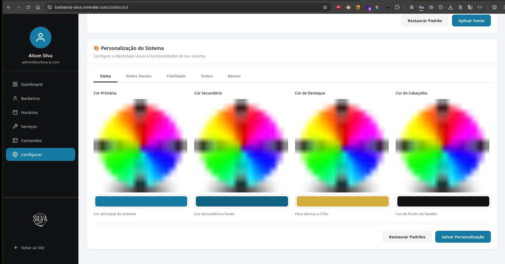
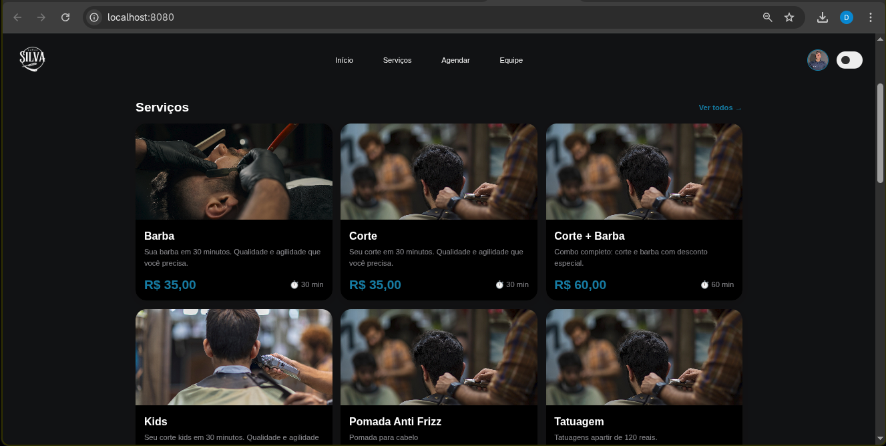

# 💈 System-Barbearia-AS

<div align="center">


**Sistema Web Full-Stack para Gestão e Agendamento de Serviços em Barbearias**

Sistema profissional de agendamento online com backend em Go, notificações em tempo real e gerenciamento completo

[Sobre](#-sobre) • [Funcionalidades](#-funcionalidades) • [Tecnologias](#-tecnologias) • [Instalação](#-instalação) • [Equipe](#-equipe)

</div>

---

## 📸 Preview do Sistema

<div align="center">

### 💻 Versão Desktop


*Interface moderna com tema escuro, sistema de agendamento completo e notificações em tempo real*

### 📱 Versão Mobile


*Layout responsivo com bottom navigation e experiência otimizada para dispositivos móveis*

</div>

---

## 📋 Sobre

O **System-Barbearia-AS** é uma aplicação web completa desenvolvida para otimizar a gestão de barbearias, oferecendo uma experiência moderna e profissional tanto para clientes quanto para administradores. O sistema combina backend robusto em Go, frontend responsivo e funcionalidades avançadas de notificação.

### 🎯 Objetivo

Criar uma plataforma integrada que simplifique a rotina das barbearias, permitindo:
- Agendamento online de serviços
- Gestão de profissionais e horários
- Programa de fidelidade automatizado
- Interface responsiva e intuitiva
- Experiência otimizada em dispositivos móveis e desktop

---

## ✨ Funcionalidades

### 🌓 Tema Claro/Escuro
- Alternância entre modo claro e escuro
- Persistência de preferência do usuário via LocalStorage
- Aplicação automática do tema escolhido
- Design otimizado para ambos os modos

### 📱 Design Responsivo
- Layout adaptativo para todos os dispositivos
- 7 breakpoints responsivos (380px até 1920px)
- Menu de navegação desktop e mobile
- Otimização para experiência móvel

### 💼 Catálogo de Serviços
- **Corte**: R$ 35,00 (30 minutos)
- **Barba**: R$ 35,00 (30 minutos)
- **Kids**: R$ 35,00 (30 minutos)
- Cards interativos com imagens e descrições
- Layout em grid responsivo

### 🎁 Programa de Fidelidade
- "Complete 10 visitas e ganhe seu próximo corte"
- Banner promocional com call-to-action
- Incentivo ao retorno de clientes

### 👨‍💼 Perfil de Barbeiros
- Destaque para profissionais
- Foto e apresentação do barbeiro (Alison Silva)
- Design elegante e profissional

### 📞 Informações de Contato
- Telefone: 61 00000-0000
- Instagram: @Silva_barbearia
- Endereço: Morro Azul - Quadra 11 Conjunto A
- CNPJ: 00.000.000/0001-00

---

## 🚀 Tecnologias

### Backend
- **Go 1.25.4** - Linguagem de programação
- **Gin Framework v1.11.0** - Web framework HTTP
- **SQLite** - Banco de dados embutido
- **go-sqlite3** - Driver SQLite para Go
- **Clean Architecture** - Separação de camadas (handlers, models, database)

### Frontend
- **HTML5** - Estrutura semântica e acessível
- **CSS3** - Estilização moderna com Flexbox e Grid
- **JavaScript (ES6+)** - Interatividade e manipulação do DOM
- **LocalStorage API** - Persistência de dados client-side

### Design
- **Mobile-First** - Prioridade para dispositivos móveis
- **Responsive Design** - Adaptação automática de layout
- **CSS Variables** - Temas claro/escuro dinâmicos
- **Smooth Transitions** - Animações e transições suaves

---

## 📦 Instalação

### Pré-requisitos
- **Go 1.25.4+** instalado ([Download](https://go.dev/dl/))
- Navegador web moderno (Chrome, Firefox, Safari, Edge)

### Passos

1. **Clone o repositório**
```bash
git clone https://github.com/seu-usuario/System-Barbearia-AS.git
cd System-Barbearia-AS
```

2. **Instale as dependências do backend**
```bash
cd backend
go mod download
```

3. **Inicie o servidor**
```bash
cd cmd/api
go run main.go
```

O servidor iniciará em `http://localhost:8080` e criará automaticamente:
- Banco de dados SQLite em `backend/cmd/api/data/barbearia.db`
- Usuário admin: `admin@barbearia.com` / `admin123`
- Usuário cliente teste: `cliente@teste.com` / `cliente123`
- Barbeiro padrão: Alison Silva
- 4 Serviços: Corte, Barba, Kids, Corte + Barba

4. **Acesse no navegador**
```
http://localhost:8080
```

### 🎯 Rotas Principais
- `/` - Página inicial
- `/login` - Login de usuários
- `/agendar` - Agendamento de horários (requer login)
- `/dashboard` - Painel administrativo (requer login admin)

### 💡 Dica
O sistema funciona em Windows e Linux sem necessidade de compiladores C (CGO-free)!

---

## 📁 Estrutura do Projeto

```
System-Barbearia-AS-prod/
│
├── README.md                          # Documentação do projeto
│
└── Front-Barbearia-home/              # Frontend da aplicação
    │
    ├── home.html                      # Página principal
    ├── blackMode.js                   # Gerenciador de temas
    │
    ├── css/                           # Folhas de estilo
    │   ├── desktopHome.css           # Estilos desktop (principal)
    │   ├── desktopHomeBlackMode.css  # Estilos modo escuro
    │   ├── fontStyleHome.css         # Fontes e animações
    │   ├── responsivo.css            # Media queries (modo claro)
    │   └── responsivoBlack.css       # Media queries (modo escuro)
    │
    ├── icons/                         # Ícones da interface
    │   ├── calendar2.svg             # Ícone de agendamento
    │   ├── home.svg                  # Ícone de início
    │   ├── moon.png                  # Ícone modo escuro
    │   ├── sun.svg                   # Ícone modo claro
    │   ├── person.svg                # Ícone de perfil
    │   └── servico.svg               # Ícone de serviços
    │
    └── img/                           # Imagens e logos
        ├── alissonFt.png             # Foto do barbeiro
        ├── barba.png                 # Serviço de barba
        ├── kids.jpg                  # Serviço kids
        ├── logoDark.jpeg             # Logo modo escuro
        ├── logoWhite.jpeg            # Logo modo claro
        ├── maquina.jpg               # Background fidelidade
        └── meta.jpg                  # Serviço de corte
```

---

## 🎨 Paleta de Cores

### Modo Claro
```css
--background-primary: #090A0C     /* Fundo escuro */
--background-secondary: #F0F0F0   /* Cards (cinza claro) */
--accent-color: #0D7CA4           /* Azul (botões/CTAs) */
--text-primary: #FFFFFF           /* Texto branco */
--text-secondary: #CBCBCB         /* Cinza claro */
```

### Modo Escuro
```css
--background-primary: #18191C     /* Cinza escuro */
--background-secondary: #282828   /* Cards (cinza médio) */
--accent-color: #0D7CA4           /* Azul (botões/CTAs) */
--text-primary: #FFFFFF           /* Texto branco */
--text-secondary: #F4F4F4         /* Texto cinza claro */
```

---

## 📱 Breakpoints Responsivos

| Dispositivo | Largura | Características |
|------------|---------|-----------------|
| Desktop XL | 1920px+ | Layout máximo |
| Desktop L  | 1600px  | Containers reduzidos |
| Desktop M  | 1350px  | Navegação ajustada |
| Desktop S  | 1225px  | Cards em 2 colunas |
| Tablet     | 1150px  | Menu mobile ativo |
| Mobile L   | 800px   | Layout vertical |
| Mobile M   | 580px   | Cards reduzidos |
| Mobile S   | 380px   | Telas pequenas |

---

## 🗂️ Componentes

### Header
- Logo da barbearia
- Menu de navegação (Início, Serviços, Agendar, Barbeiros)
- Botão de acesso/login
- Toggle de tema claro/escuro

### Main
- **Seção Logo**: Apresentação visual da marca
- **Seção Fidelidade**: Banner promocional com CTA
- **Seção Barbeiro**: Destaque do profissional
- **Seção Catálogo**: Grid de cards com serviços

### Footer
- Logo da barbearia
- Informações de contato
- Redes sociais
- Dados da empresa (CNPJ)

---

## 🔧 Funcionalidades Técnicas

### Theme Switcher (blackMode.js)
```javascript
// Alterna entre temas claro e escuro
// Persiste preferência em localStorage
// Atualiza classes CSS dinamicamente
// Troca ícones (sol/lua)
```

### Responsividade
- Flexbox para layouts fluidos
- Media queries em cascata
- Mobile-first approach
- Touch-friendly (botões grandes)

### Performance
- CSS modular (5 arquivos separados)
- Imagens otimizadas
- JavaScript minimalista
- Carregamento rápido

---

## 🛣️ Roadmap

### ✅ Fase 1 - Frontend Base (Concluído)
- [x] Design da página inicial
- [x] Sistema de temas claro/escuro
- [x] Layout responsivo completo
- [x] Catálogo de serviços
- [x] Seção de barbeiros

### ✅ Fase 2 - Backend Completo (Concluído)
- [x] API REST completa para agendamentos
- [x] Banco de dados SQLite funcional
- [x] Sistema de autenticação com bcrypt
- [x] Painel administrativo funcional
- [x] Gerenciamento de horários e disponibilidade
- [x] CRUD de barbeiros e serviços
- [x] Sistema de notificações
- [x] Compatibilidade Windows/Linux (sem CGO)

### ✅ Fase 3 - Agendamento Online (Concluído)
- [x] Sistema de agendamento online completo
- [x] Verificação de disponibilidade em tempo real
- [x] Página de login funcional
- [x] Integração frontend com API
- [x] Carregamento dinâmico de serviços
- [x] Dashboard com métricas

### 📋 Fase 4 - Melhorias Futuras (Planejado)
- [ ] Notificações por email/SMS
- [ ] PWA (Progressive Web App)
- [ ] Pagamentos online
- [ ] Sistema de avaliações
- [ ] Analytics e relatórios detalhados
- [ ] Chatbot de atendimento

---

## 👥 Equipe

<div align="center">

### Desenvolvedores

<table>
  <tr>
    <td align="center">
      <a href="https://github.com/EoDaniel777">
        <br>
        
      </a><br>
      <sub><strong>Daniel Alisom</strong></sub><br>
      <p>🔧 Backend em Go<br>🗄️ Arquitetura de Banco<br>🔐 APIs & Autenticação</p>
    </td>
    <td align="center">
      <a href="https://github.com/B-Evil">
        <br>
        
      </a><br>
      <sub><strong>Bruno Santiago</strong></sub><br>
      <p>🎨 Interfaces Web<br>📱 Responsividade<br>🔌 Integração com APIs</p>
    </td>
    <td align="center">
      <a href="https://github.com/Thaysantzs">
        <br>
        
      </a><br>
      <sub><strong>Thiago Santiago</strong></sub><br>
      <p>🎭 Design UI/UX<br>📲 Otimização Mobile<br>✨ Experiência do Usuário</p>
    </td>
  </tr>
  <tr>
    <td align="center" colspan="3">
      <a href="https://instagram.com/bradock_baber">
        
      </a><br>
      <sub><strong>Alison Silva</strong></sub><br>
      <p>💈 Barbeiro Profissional | 📊 Proprietário da Barbearia Silva | 🎯 Visão do Produto</p>
      <sub>📍 Morro Azul - Quadra 11 Conjunto A | 📱 @bradock_baber</sub>
    </td>
  </tr>
</table>

### Tecnologias Utilizadas


</div>

---

## 🔌 APIs Disponíveis

### Autenticação
- **POST** `/api/v1/auth/login` - Login de usuários
- **POST** `/api/v1/auth/register` - Registro de novos clientes
- **GET** `/api/v1/auth/me` - Informações do usuário logado

### Barbeiros
- **GET** `/api/v1/barbeiros` - Listar todos os barbeiros ativos
- **GET** `/api/v1/barbeiros/:id` - Buscar barbeiro por ID
- **POST** `/api/v1/barbeiros` - Criar novo barbeiro (admin)
- **PUT** `/api/v1/barbeiros/:id` - Atualizar barbeiro (admin)
- **DELETE** `/api/v1/barbeiros/:id` - Desativar barbeiro (admin)

### Serviços
- **GET** `/api/v1/servicos` - Listar todos os serviços ativos
- **GET** `/api/v1/servicos/:id` - Buscar serviço por ID
- **POST** `/api/v1/servicos` - Criar novo serviço (admin)
- **PUT** `/api/v1/servicos/:id` - Atualizar serviço (admin)
- **DELETE** `/api/v1/servicos/:id` - Desativar serviço (admin)

### Agendamentos
- **GET** `/api/v1/horarios` - Listar todos os agendamentos
- **GET** `/api/v1/horarios/disponibilidade` - Verificar horários disponíveis
- **POST** `/api/v1/horarios` - Criar novo agendamento
- **PATCH** `/api/v1/horarios/:id/status` - Atualizar status do agendamento
- **DELETE** `/api/v1/horarios/:id` - Cancelar agendamento

### Notificações
- **GET** `/api/v1/notifications` - Listar notificações do usuário
- **PATCH** `/api/v1/notifications/:id/read` - Marcar notificação como lida

---

## 📄 Licença

Este projeto está sob a licença MIT. Veja o arquivo [LICENSE](LICENSE) para mais detalhes.

---

## 📞 Contato

- **Telefone**: 61 00000-0000
- **Instagram**: [@Silva_barbearia](https://instagram.com/Silva_barbearia)
- **Endereço**: Morro Azul - Quadra 11 Conjunto A
- **CNPJ**: 00.000.000/0001-00

---

## 🤝 Contribuindo

Contribuições são bem-vindas! Para contribuir:

1. Fork o projeto
2. Crie uma branch para sua feature (`git checkout -b feature/AmazingFeature`)
3. Commit suas mudanças (`git commit -m 'Add some AmazingFeature'`)
4. Push para a branch (`git push origin feature/AmazingFeature`)
5. Abra um Pull Request

---

## 📝 Changelog

### [3.0.0] - 2026-01-10
#### Adicionado Backend
- API REST completa com Go + Gin Framework
- Banco de dados SQLite (compatível Windows/Linux sem CGO)
- Sistema de autenticação com bcrypt
- CRUD completo de Barbeiros e Serviços
- Sistema de gerenciamento de horários de trabalho
- Verificação de disponibilidade em tempo real
- Sistema de notificações
- Dashboard administrativo funcional
- Seeds automáticos para dados iniciais

#### Adicionado Frontend
- Página de login com autenticação completa
- Página de agendamento online integrada com API
- Carregamento dinâmico de serviços da API
- Verificação de horários disponíveis
- Seleção de barbeiro, serviço, data e hora
- Feedback visual em todas as interações
- Proteção de rotas (redirecionamento para login)

#### Melhorado
- UI/UX mobile em todas as páginas
- Performance no carregamento de dados
- Segurança com hash de senhas
- Tratamento de erros consistente

### [2.0.0] - 2025-12-26
#### Adicionado
- Estrutura do backend em Go
- Configuração inicial do banco de dados
- Sistema de notificações
- Dashboard base

### [1.0.0] - 2025-11-23
#### Adicionado
- Página inicial completa
- Sistema de temas claro/escuro
- Design responsivo (7 breakpoints)
- Catálogo de serviços
- Seção de fidelidade
- Perfil de barbeiro
- Footer com informações de contato

#### Corrigido
- Caminhos de imagens de background
- Compatibilidade com diferentes navegadores

---

<div align="center">

**Desenvolvido com ❤️ para Barbearia Silva**

[⬆ Voltar ao topo](#-system-barbearia-as)

</div>
